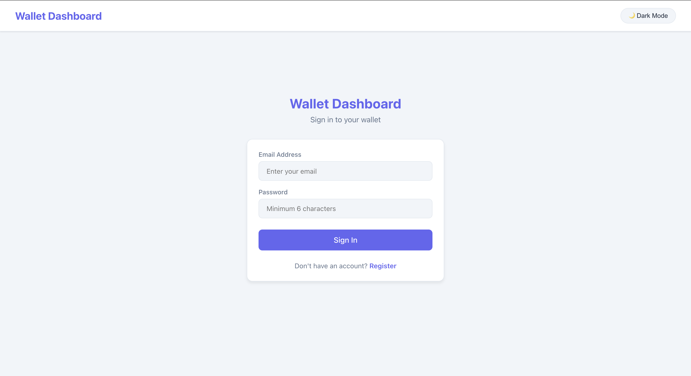
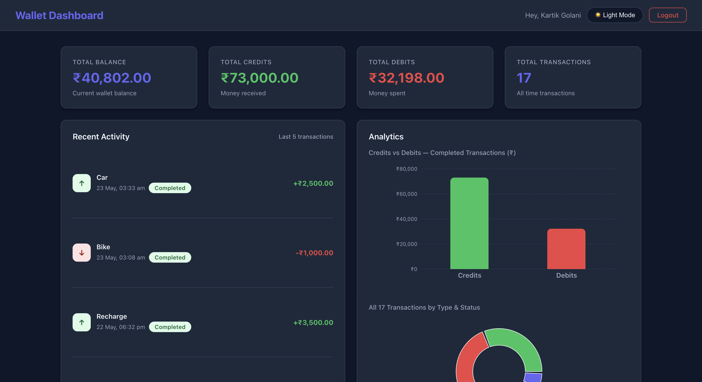
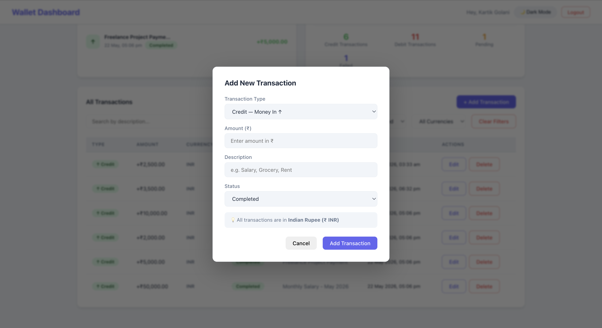
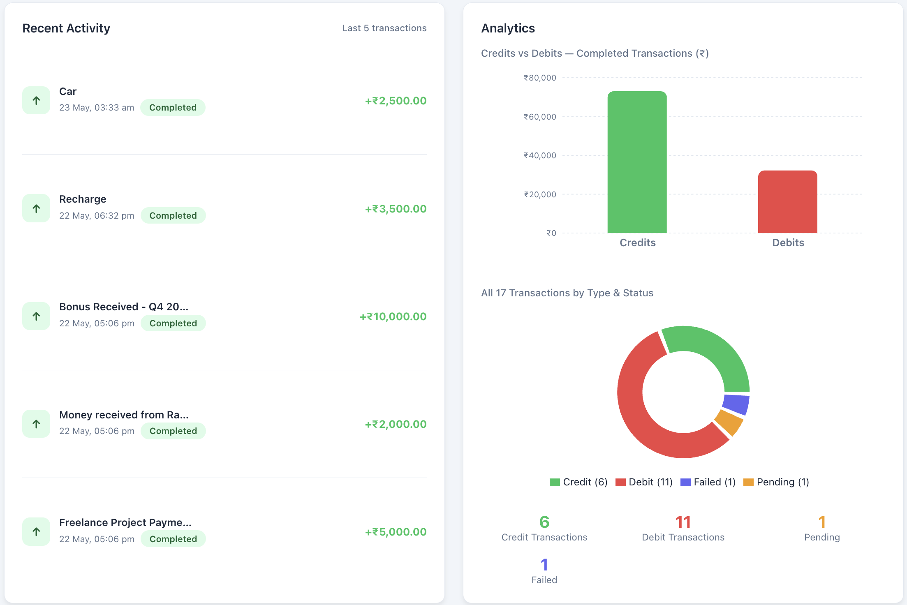

# 💰 Wallet Management Dashboard

A full-stack personal finance dashboard built with React.js and Node.js/Express. Manage your wallet — add money, spend money, track every transaction, and always know your exact balance in real time.

---

## Features

### Core Features
- Live wallet balance that updates instantly after every transaction
- Total credits, total debits and total transaction count on the dashboard
- Add credit (money in) and debit (money out) transactions
- Balance guard — debit is automatically blocked if your balance is insufficient
- Transaction table showing type, amount, currency, status, description and date
- Search transactions by description
- Filter transactions by type, status and currency
- Pagination for transaction list

### Bonus Features
- Edit any existing transaction
- Delete any transaction
- Recent activity section showing your latest 5 transactions
- Analytics with bar chart (credits vs debits) and pie chart (transaction breakdown)
- Dark mode toggle
- JWT Authentication — register and login with your own account
- Per-user wallet — every user has their own separate wallet and transactions
- Data persistence — all data is saved to a JSON file and survives server restarts

---

## Tech Stack

**Frontend**
- React.js with Hooks (useState, useEffect, useReducer, useContext)
- Context API with useReducer for global state management
- Axios for API calls
- Recharts for analytics charts
- Responsive CSS with dark mode support

**Backend**
- Node.js with Express.js
- JWT authentication with bcryptjs for password hashing
- express-validator for request validation
- JSON file storage for data persistence
- Modular MVC architecture

---

## Project Structure

```
wallet-dashboard/
├── backend/
│   ├── src/
│   │   ├── controllers/
│   │   │   ├── authController.js
│   │   │   ├── walletController.js
│   │   │   └── transactionController.js
│   │   ├── routes/
│   │   │   ├── auth.js
│   │   │   ├── wallet.js
│   │   │   └── transactions.js
│   │   ├── middleware/
│   │   │   ├── auth.js
│   │   │   ├── validate.js
│   │   │   └── errorHandler.js
│   │   ├── store/
│   │   │   └── db.js
│   │   └── utils/
│   │       └── balance.js
│   ├── app.js
│   ├── server.js
│   └── .env
├── frontend/
│   └── src/
│       ├── api/
│       │   └── index.js
│       ├── context/
│       │   └── WalletContext.jsx
│       ├── components/
│       │   ├── SummaryCards.jsx
│       │   ├── TransactionTable.jsx
│       │   ├── AddTransactionForm.jsx
│       │   ├── Filters.jsx
│       │   ├── Analytics.jsx
│       │   └── RecentActivity.jsx
│       └── pages/
│           ├── Dashboard.jsx
│           └── Login.jsx
└── README.md
```

---

## Getting Started

### Requirements
- Node.js version 16 or above
- npm

Check your versions by running:
```bash
node --version
npm --version
```

---

### Step 1 — Clone the repository

```bash
git clone https://github.com/kartik8904/wallet-dashboard.git
cd wallet-dashboard
```

---

### Step 2 — Set up the Backend

Open a terminal and run:

```bash
cd backend
npm install
```

Create a .env file inside the backend folder. You can copy the example file:

```bash
cp .env.example .env
```

Or create it manually with this exact content:

```
PORT=5000
NODE_ENV=development
CORS_ORIGIN=http://localhost:3000
JWT_SECRET=wallet_super_secret_key_2024
```

Start the backend server:

```bash
node server.js
```

You should see this in your terminal:
```
Server running on http://localhost:5000
```

Verify it is working by visiting this URL in your browser:
```
http://localhost:5000/api/health
```

You should see:
```json
{ "success": true, "message": "Server is running" }
```

---

### Step 3 — Set up the Frontend

Open a new terminal tab, keep the backend running, and run:

```bash
cd frontend
npm install
npm start
```

The app will open automatically in your browser at:
```
http://localhost:3000
```

---

### Step 4 — Create your account and start using the app

- You will see the login page first
- Click Register to create a new account
- Enter your name, email and password (minimum 6 characters)
- You will be taken straight to your personal dashboard
- Start by adding a credit transaction to fund your wallet
- Then try adding a debit — it will be blocked if your balance is insufficient

---

## API Endpoints

### Auth Routes — no login required
| Method | Endpoint | What it does |
|--------|----------|-------------|
| POST | /api/auth/register | Create a new account |
| POST | /api/auth/login | Login to your account |
| GET | /api/auth/me | Get current logged in user |

### Wallet Routes — login required
| Method | Endpoint | What it does |
|--------|----------|-------------|
| GET | /api/wallet | Get your wallet balance and totals |

### Transaction Routes — login required
| Method | Endpoint | What it does |
|--------|----------|-------------|
| GET | /api/transactions | Get all your transactions |
| POST | /api/transactions | Add a new transaction |
| PATCH | /api/transactions/:id | Edit an existing transaction |
| DELETE | /api/transactions/:id | Delete a transaction |

### Filters for GET /api/transactions
```
?search=grocery        Search by description
?type=credit           Filter by type: credit or debit
?status=completed      Filter by status: completed, pending, failed
?currency=INR          Filter by currency
?page=1&limit=10       Pagination controls
```

---

## How the Balance Guard Works

This is the core FinTech logic of the app. If your wallet has Rs 500 and you try to debit Rs 600, it gets blocked in two places:

1. The frontend checks your available balance before making the API call and shows an error immediately
2. The backend double checks and returns a 400 error with a clear message even if someone tries to bypass the frontend

This means the balance can never go negative under any circumstance.

---

## How Balance is Calculated

Balance is never stored as a fixed number in the database. It is always calculated fresh from the complete transaction history every time you load the dashboard:

Balance = Sum of all completed credits minus Sum of all completed debits

Only completed transactions affect your balance. Pending and failed transactions are stored and visible in the table but they do not change your actual balance. This is exactly how real banking systems work.

---

## Data Storage

All data is saved in two JSON files inside the backend folder. These are created automatically when the server starts for the first time — you do not need to create them manually.

- data.json stores wallet and transaction data separately for each user
- users.json stores registered user accounts with securely hashed passwords

Both files are listed in .gitignore and are never pushed to GitHub for security reasons.

---

## Important Note for Mac Users

Mac's AirPlay Receiver uses port 5000 by default which causes a 403 error. Fix it using one of these two options:

Option 1 — Turn off AirPlay Receiver:
Go to System Settings, then General, then AirDrop and Handoff, then turn AirPlay Receiver off.

Option 2 — Change the app port:
In backend/.env change PORT=5000 to PORT=8000
In frontend/.env change REACT_APP_API_URL to http://localhost:8000/api

---

## Screenshots

### Login Page


### Dashboard Light Mode


### Dashboard Dark Mode


### Add Transaction Modal


### Analytics Charts


---

## What I Would Add With More Time

- MongoDB or PostgreSQL for production-grade database storage
- Real-time currency conversion API for multi-currency wallets
- Email notifications for large or suspicious transactions
- Export transactions to CSV or PDF
- Transaction categories and monthly spending insights
- Budget tracking and spending limits per category

---

Built by Kartik Golani
